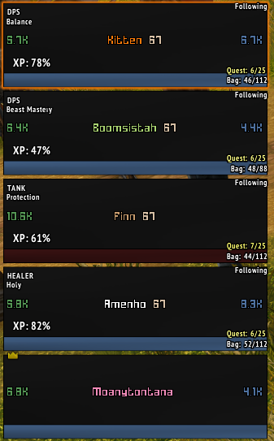
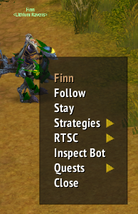
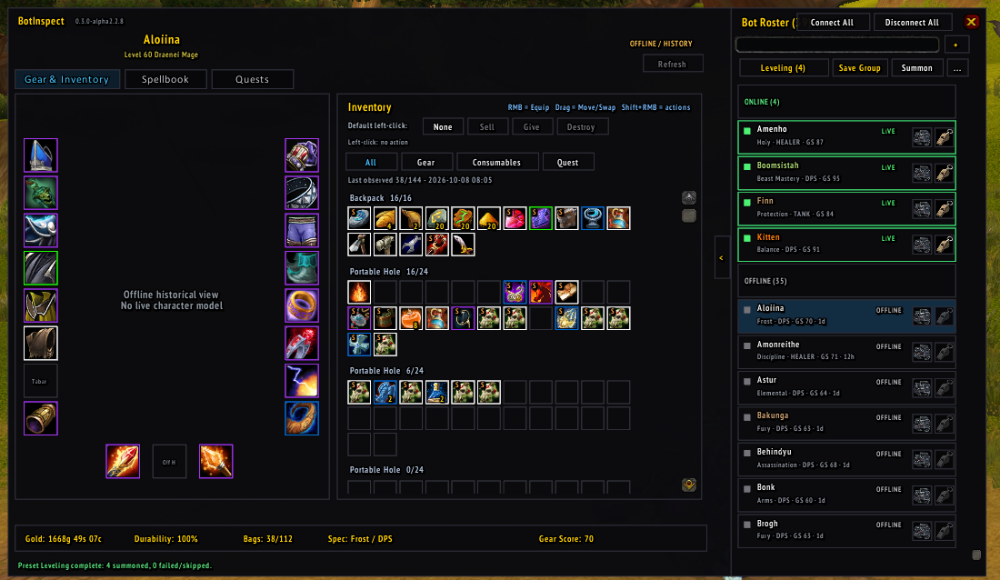
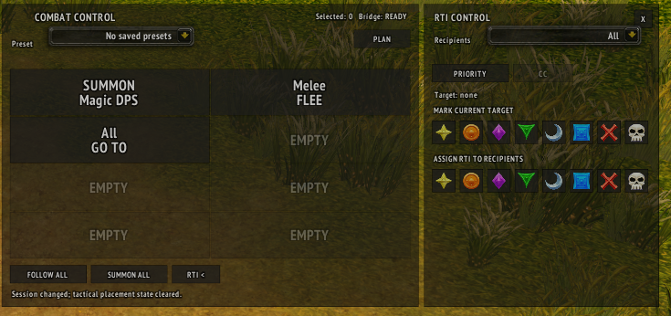

# ElvUI_Multibot

**An ElvUI-integrated command center for AzerothCore Playerbots.**

Control your companions, inspect their characters, manage equipment and quests, configure combat strategies, and organize parties or full raids — all through a graphical interface designed for World of Warcraft 3.3.5a.

**Compatibility:** WoW 3.3.5a · ElvUI 6.09 · AzerothCore Playerbots

**Development status:** Alpha — under active development.

---

## Overview

AzerothCore Playerbots makes it possible to adventure alongside AI-controlled characters, from a small leveling party to a complete raid.

However, controlling multiple characters through chat commands, macros, and separate interfaces can quickly become cumbersome.

**ElvUI_Multibot aims to solve this.**

It brings Playerbots management into ElvUI through a collection of interconnected modules, giving players a more accessible way to interact with their bots without constantly switching between chat commands and game windows.

The suite is modular: install the features you want, with a shared Core that handles communication, bot identification, state management, and integration.

## Features at a glance

- **Integrated bot unit frames:** Bot indicators, selection controls, status information, and customization.
- **Context-sensitive commands:** Access bot actions directly from unit frames or the game world.
- **Character and inventory inspection:** Examine equipment, inventory, statistics, and available character information.
- **Quest management:** Inspect a bot's active quests and abandon quests through the interface.
- **Equipment management:** Manage items, equipment, and supported inventory operations.
- **Bot lifecycle management:** Connect, disconnect, and summon bots through the interface.
- **Group management:** Save and recall groups of bots for different gameplay activities.
- **Combat strategies:** Inspect and modify supported strategies for individual bots.
- **Tactical raid controls:** Direct bot groups using formations, raid target icons, positioning commands, and saved command presets.
- **Persistent character information:** Retain supported snapshots for inspecting previously connected bots.

Feature availability depends on the installed module, Core version, bridge capabilities, and server configuration.

---

## Modules

### ElvUI_Multibot_Core

**The foundation of the entire suite.**

Core handles the shared infrastructure used by the other modules, including:

- Communication with the server-side Multibot Bridge.
- Bot discovery, identification, and target resolution.
- Structured requests, responses, and capability detection.
- Character information and cached snapshots.
- Shared APIs for addon modules.
- Supported Playerbots actions, strategies, and state changes.

Core is required by the other ElvUI_Multibot modules. It does not replace AzerothCore Playerbots or the server-side bridge.

### ElvUI_Multibot_UnitFrames

**Keep track of your companions directly through ElvUI.**


Extends ElvUI's party/unit-frame experience with Playerbots-specific information and controls.

Features include:

- Visual indicators identifying Playerbots.
- Configurable bot-selection interactions.
- Bot state and movement information.
- Character statistics such as experience, inventory usage, durability, and currency.
- Configurable display positions and presentation settings.

This module is designed to make everyday bot management convenient without requiring a separate window.

### ElvUI_Multibot_ContextMenu

**Right-click control, wherever you need it.**


Adds contextual Playerbots menus to supported unit frames and game-world interactions.

Features include:

- Shift-right-click menus for eligible bot frames.
- Optional contextual actions for bots in the 3D world.
- Per-bot strategy controls.
- Movement and positioning commands.
- Raid Target Icon (RTI) configuration.
- Class-appropriate and context-sensitive actions.
- Customizable menu size, appearance, and behavior.

The menu only exposes actions appropriate to its current context and available capabilities.

### ElvUI_Multibot_BotInspect

**Character management for your entire bot roster.**


A dedicated interface for examining and managing Playerbots.

Features include:

- Browse online and previously discovered bot characters.
- Inspect equipment, bags, and character information.
- Review character statistics, roles, and available specializations.
- Inspect previously saved equipment and inventory information while bots are offline.
- Equip, move, trade, sell, or destroy items where supported.
- Manage supported spellbook settings.
- Inspect active quests and abandon individual quests.
- Save, modify, and recall bot-group presets.
- Connect, disconnect, and summon bots.
- Manage supported master-looter item distribution workflows.

Offline character views are read-only. Some actions depend on the bot being connected, nearby, or in a suitable gameplay state.

### ElvUI_Multibot_CommandPanel

**Tactical control for parties and large Playerbots raids.**


The Command Panel is intended for situations where controlling each bot individually becomes impractical.

Features and ongoing development areas include:

- Group-wide commands such as Follow, Stay, and Summon.
- Saved command configurations and shortcuts.
- Tactical movement and positioning.
- Raid Target Icon assignments.
- Formation controls.
- Commands targeted at selected roles or bot groups.
- RTSC location-based positioning.
- Experimental Go To and group repositioning workflows.

**Status:** Experimental. Some multi-bot command chains and tactical movement workflows remain under development. Results may vary depending on the number of bots, server behavior, and Playerbots command handling.

---

## Requirements

### Game client

- World of Warcraft 3.3.5a (Wrath of the Lich King).
- ElvUI 6.09
- A server supporting the required AzerothCore Playerbots integration.

### Server

- AzerothCore with the compatible Playerbots fork.
- [mod-playerbots](https://github.com/mod-playerbots/mod-playerbots).
- [mod-multibot-bridge](https://github.com/Wishmaster117/mod-multibot-bridge).

**Important:** This addon is not intended for retail WoW, modern Classic clients, or ordinary servers without the required Playerbots integration.

The bridge is a server-side dependency. Installing the ElvUI addon alone will not provide its structured bot-control functionality.

## Installation

### Step 1 — Prepare the server

Install and configure AzerothCore Playerbots following the [official Playerbots installation guide](https://github.com/mod-playerbots/mod-playerbots/wiki/Installation-Guide).

Install the [Multibot Bridge](https://github.com/Wishmaster117/mod-multibot-bridge) in your AzerothCore `modules` directory, rebuild the server, and confirm the bridge is loaded.

You need access to a server where these modules are installed and configured.

### Step 2 — Install ElvUI

Install ElvUI 6.09 for the WoW 3.3.5a client.

Verify that ElvUI loads successfully before adding ElvUI_Multibot.

### Step 3 — Download ElvUI_Multibot

Download the addon suite from this repository's **Releases** section.

Extract the included module folders into:

`World of Warcraft/Interface/AddOns/`

The expected result is:

```text
Interface/
└── AddOns/
    ├── ElvUI/
    ├── ElvUI_Config/
    ├── ElvUI_Multibot_Core/
    ├── ElvUI_Multibot_UnitFrames/
    ├── ElvUI_Multibot_ContextMenu/
    ├── ElvUI_Multibot_BotInspect/
    └── ElvUI_Multibot_CommandPanel/
```

Each installed module should contain its own `.toc` file directly inside its folder.

**Do not create an extra enclosing addon directory** around these folders.

### Step 4 — Enable the modules

1. Start WoW 3.3.5a.
2. Open the **AddOns** menu on the character-selection screen.
3. Enable ElvUI, ElvUI_Multibot_Core, and any optional modules you want.
4. Log in to a character with access to Playerbots.
5. Open ElvUI's configuration and look for the Multibot module settings.

### Step 5 — Connect your bots

Use the available BotInspect controls or your existing Playerbots setup to connect your alt characters.

Once connected and resolved, supported modules can inspect and interact with them.

If features are missing, verify that the server-side bridge is installed, active, and supports the capabilities expected by the installed Core version.

---

## Getting started

### Everyday party management

For a typical leveling or dungeon party:

1. Connect your bot characters.
2. Use the UnitFrames indicators to identify and select bots.
3. Open the context menu with Shift-right-click on a supported bot frame.
4. Inspect equipment and inventory through BotInspect.
5. Manage quests and other character information as needed.
6. Save your preferred group composition as a preset for future use.

### Managing equipment and inventory

Open BotInspect and select a character from the roster.

Inspect its equipped items, inventory, and character information. Use the available controls to perform supported equipment and inventory actions.

Some actions require the bot to be online or within interaction range.

### Managing quests

Open the quest view in BotInspect and select a bot.

Review its recorded quests and use the supported controls to abandon unwanted quests.

Quest operations depend on Playerbots and bridge support. Always check the displayed result after modifying a bot's quest log.

### Managing a raid

For larger parties or raids, enable CommandPanel.

Use its group-targeting, formation, tactical positioning, and raid-marker tools to coordinate bot behavior.

Advanced group repositioning remains experimental and should be tested before relying on it during difficult encounters.

---

## Configuration

The suite integrates its customization settings into ElvUI.

Depending on the module, options include:

- Unit-frame indicators and status presentation.
- Context-menu activation and appearance.
- Panel positioning and display behavior.
- Relevant module-specific interaction preferences.

Individual module settings can be configured without requiring every optional module to be installed.

---

## Compatibility and limitations

ElvUI_Multibot is developed and tested for a specific combination of legacy WoW client, ElvUI version, Playerbots implementation, and bridge functionality.

Please be aware:

- Supported actions may differ between bridge and Playerbots revisions.
- Some operations are unavailable while a bot is offline.
- Read-only cached information may not represent the bot's current live state.
- Playerbots AI limitations are not necessarily addon bugs.
- Certain advanced tactical workflows are experimental.
- This suite does not add missing server-side capabilities by itself.
- Not every Playerbots feature is exposed in a graphical interface.

The goal is to make the available Playerbots functionality easier to access, not to replace Playerbots itself.

## Related projects and credits

ElvUI_Multibot builds on the work of several open-source communities:

- [AzerothCore](https://github.com/azerothcore/azerothcore-wotlk) — World of Warcraft server framework.
- [AzerothCore Playerbots](https://github.com/mod-playerbots/mod-playerbots) — AI-controlled player characters.
- [Multibot Bridge](https://github.com/Wishmaster117/mod-multibot-bridge) — structured communication with the Playerbots integration.
- [ElvUI](https://github.com/ElvUI-WotLK/ElvUI) — the interface framework.

This project is an independent community addon suite and is not officially affiliated with or endorsed by the maintainers of these projects.

All names and trademarks remain the property of their respective owners.

## Bug reports and contributions

Feedback, reproducible bug reports, and code contributions are welcome.

When reporting a problem, please provide:

- ElvUI_Multibot module versions.
- ElvUI version.
- AzerothCore and Playerbots revisions, if known.
- Multibot Bridge version or commit.
- Steps required to reproduce the problem.
- Lua error messages, if any.
- Screenshots when relevant.

Please search existing GitHub Issues before opening a duplicate report.

## Development status

ElvUI_Multibot is an independent, community-developed project undergoing active testing and refinement.

Contributions, issue reports, and compatibility testing are appreciated.

**Built for players who want to spend more time adventuring with their bots and less time typing commands.**
